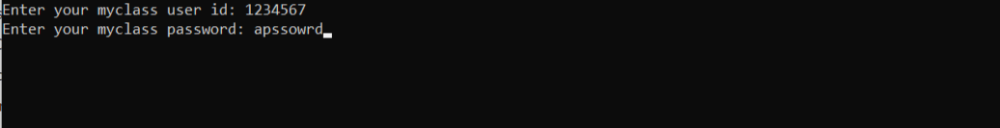

# LPU_myclass_Bot

##### LPU_myclass_Bot is a Python bot that waits for class to start, attends class, answers polls, and then again waits for another class to start. 

Only for students of Lovely Professional University.

This bot has been created using Python and Selenium Automation Framework.

## Installation 

Use the package manager [pip](https://pip.pypa.io/en/stable/) to install the following packages.

```
pip install selenium
pip install webdriver-manager
```

Clone this repository to your system.

```
git clone https://github.com/seikhchilli/LPU_myclass_bot.git
```

## Usage

```
cd LPU_myclass_bot
python main.py
```
Enter your myclass username and password:



## Contributing
Pull requests are welcome. For major changes, please open an issue first to discuss what you would like to change.


## License
[MIT](./LICENSE)